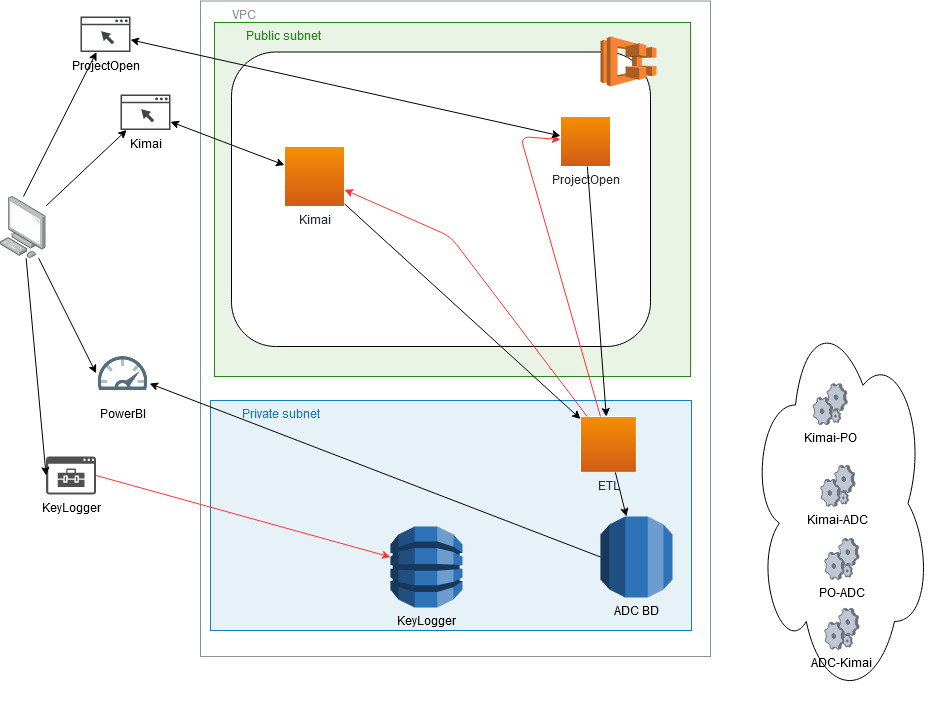

# solucionADC

## Contexto

Aircraft Digital cuenta con el uso de tecnologias para el seguimiento y control de su operación. Actualmente el seguimiento y control esta siendo soportando por las siguientes soluciones tecnologicas:
- Software Tracker: Una solución de escritorio elaborada en C#, que tiene como objetivo registrar el tiempo de ejecución de las tareas realizadas duarnte el dia. El objetivo es que las personas puedan registrar el inicio y fin de una tarea. Este sistema tambien cuenta con el registro de datos de control de la operación, necesaria por cada tarea. Esto se realiza por medio de la combinación de teclas (shortcuts).
- Excel (Macros): Una solución elaborada con macros y tiene como objetivo elaborar la planificación y control de las horas de la operación. Los lideres de la operación, mes a mes, deben planificar la asigancion de los recursos en las diferentes y lo elaboran en una hoja excel. Luego, por medio de un proceso realizado en macros, se sincroniza con información de vacaciones y incapacidades.
- Shift (Microsoft): Una solución para llevar el control de las vacaciones.
- MySQL: Se cuenta con una base datos donde se almacena los registros obtenidos del tacker y la macros.
 -PowerBI: Esta herramienta sirve como generador de reportes para la gerencia y lidres de la operación. 

## Objetivo

El objetivo del proyecto es realizar una migración del tipo refactor de la arquitectura actual a una donde se pueda aprovechar los beneficios de la nube.

## Arquitectura

Para la solución presentada se definición primero el proceso. Cabe resaltar, que la operación estaba actuando bajo un proceso de gestión de proyectos y para ello se establecio que la operación cada mes debia realizar una gestión de proyectos: planifiación, ejecución, seguimiento y control y cierre.
En el caso de planificación se utilizó una herramienta openSource Web ProjectOpen, en el cual los lideres de la operación, cada mes, colocando las tareas a realizar y las horas que deben cumplir ante sus clientes. Esto lo hacen siguiendo las buenas practicas de una gestión de proyectos con diagramas Gantt.
En el caso del seguimiento y control, se esta utilizando una herramienta openSource Web Kimai, con el objetivo de que las personas puedas registrar la hora inicio y fin de las tareas y un campo donde se registren las observaciones.
Ejecución, se ha creado una aplicación KeyLogger elaborada en C++, con el objetivo que se pueda registrar las los eventos generados por la presion de las teclas y el click del mouse. Todos los datos se estan almacenando en una base de datos DynamoBD.
Cierre, mes a mes se debe llevar el control de las horas ejecutadas por medio de reportes administrativos, para ello se esta utilizando el PowerBI como un generador de reportes.

A nivel de tecnologias se esta utilizando una base de datos relacional MySQL que contiene toda la logica del negocio a nivel de datos alojado en AWS RDS, otra base datos no Relacional AWS Dynamo, los sistemas opensource estan siendo instalados en instancias AWS Fargate por medio de un compositor de contendores AWS ECS y las comunicaciones entre las bases de datos de las soluciones Opensource y la base de datos de la empresa se logra por un proceso ETL que esta alojado en una instancia de Fargate, el cual contiene un proceso batch ejecutado cada dia.

La arquitectura se presenta a continuación.

